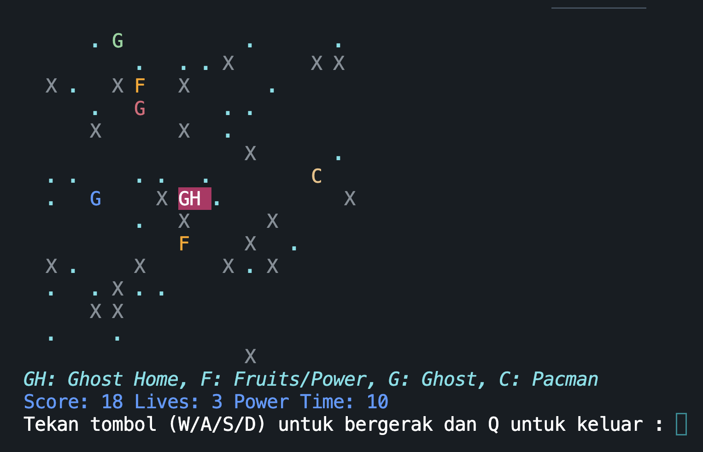

# Pacman CLI Game

A simple Pacman game in the command line interface (CLI) using JavaScript and the prompt-sync library.

## Prerequisites

Make sure you have Node.js installed on your machine. You can download it from [https://nodejs.org/](https://nodejs.org/).

## Installation

1. Clone the repository:

   ```bash
   git clone git@github.com:fadhelmurphy/pacman-cli-js.git


   ```
2. Navigate to the project directory:

```bash
cd pacman-cli-js
```

3. Install the dependencies

```npm
npm install
```

## Usage

To start the Pacman game, run the following command:Setelah menginstal dependensi, jalankan permainan dengan perintah

```
npm start
```

Follow the on-screen instructions to play the game. Use the arrow keys (w/a/s/d) to move Pacman, and press 'q' to quit the game.

## Features

* Pacman character controlled by the user.
* Ghost characters that move randomly.
* Walls to navigate around.
* Dots and fruits to collect for points.
* Power-up from eating fruits, giving temporary invincibility.

Feel free to customize and modify the game as needed!

Selamat bermain!
